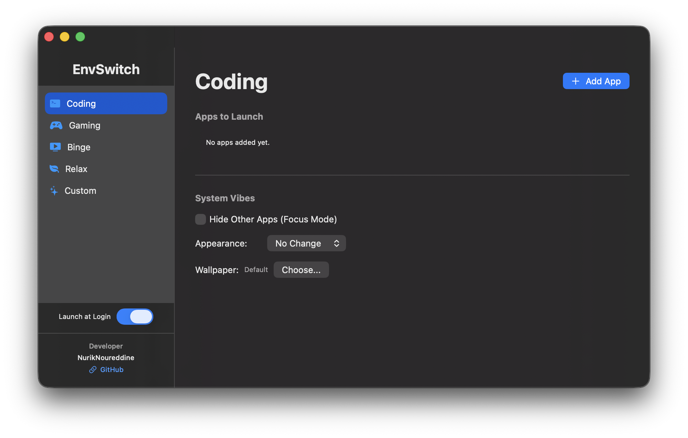
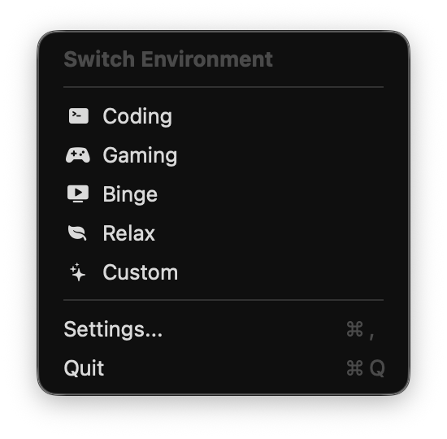

# EnvSwitch

EnvSwitch is a minimalist macOS menu bar application for developers and power users who need to switch between different digital contexts (coding, gaming, relaxing, etc.) quickly.

It follows a **“total user control”** philosophy: no pre-assigned apps; environments are defined locally from scratch.

## Download

- **Source code:** everything needed to build is in this repo (Swift + Xcode project). Tracked files intentionally omit maintainer-specific signing IDs and team IDs—set those locally in Xcode or in the shell when packaging.
- **Installable disk image:** a pre-built **`EnvSwitch.dmg`** is attached to **Releases** (example URL pattern: `https://github.com/<username>/EnvSwitch/releases`). The DMG is **not** stored inside git—only uploaded as a release asset.

After download: open the DMG, drag **EnvSwitch** into **Applications**, launch from there.

**Signing, Gatekeeper, and “malware” prompts:**

| What was used | Typical downloader experience |
|----------------|------------------------------|
| **Unsigned** | Strongest warnings (“damaged” / blocked). |
| **Apple Development** (personal dev cert) | Still often blocked or warned for people who did not build it; not meant for wide distribution. |
| **Developer ID Application** + **notarization** + **staple** | Smoothest path for random Macs; closest to avoiding “can’t be checked for malware” / unknown-developer friction. |

Release DMGs here are documented as **not notarized / not stapled** unless a given release notes says otherwise. If macOS still complains, use **System Settings → Privacy & Security**, **right‑click → Open** once, or **build from source** and sign with a local identity.

## Features

- **Context switching** — launch groups of apps from the menu bar.
- **System vibes** — optional dark/light mode, wallpaper, and focus-style hiding of other apps per environment.
- **App gallery** — browse installed apps inside settings.
- **Dynamic menu bar icon** — reflects the active environment.
- **SwiftUI** settings UI.

## Build from source

1. Clone the repository and open `EnvSwitch.xcodeproj` in **Xcode**.
2. In **Signing & Capabilities**, select a development team (the repository does not bundle team IDs or personal signing certificates).
3. **⌘R** to run.

Requires **macOS 14+** and a recent **Xcode** (Swift 5 toolchain).

### Optional: package a DMG locally

See [**RELEASING.md**](RELEASING.md) and `scripts/package-dmg.sh`. Either set `CODESIGN_IDENTITY` to a keychain signing identity, or use `SKIP_CODESIGN=1` for an unsigned disk image.

## License

This project is under the **GNU General Public License v3.0 only** ([SPDX: GPL-3.0-only](https://spdx.org/licenses/GPL-3.0-only.html)) — see [LICENSE](LICENSE). Version 3 as published by the FSF; **not** “or any later version.”

The `LICENSE` file is the **unmodified** GPLv3 legal text from the Free Software Foundation; that document uses standard second-person legal wording required for redistribution.
